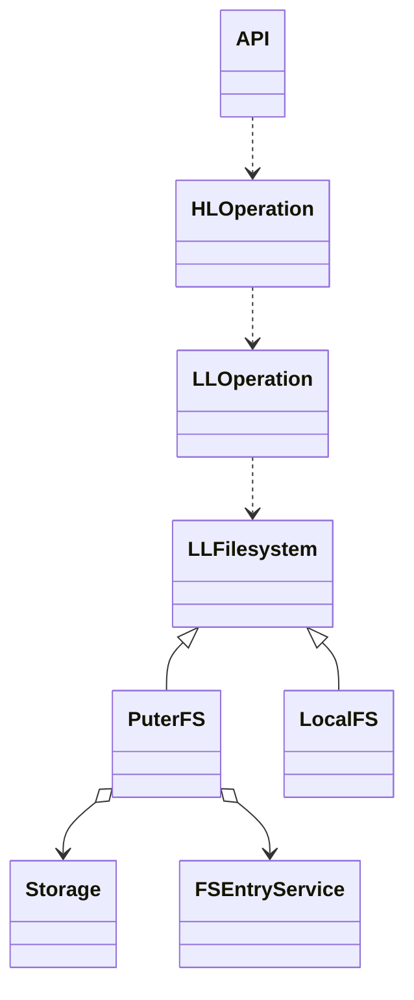

### implementations needed
- stat a file from fsentry row or inode
- get a read stream for a file
- 

```mermaid
classDiagram
    API ..> HLOperation
    HLOperation ..> LLOperation
    LLOperation ..> LLFilesystem
    LLFilesystem <|-- PuterFS
    LLFilesystem <|-- LocalFS
    PuterFS o--> Storage
    PuterFS o--> FSEntryService
```
